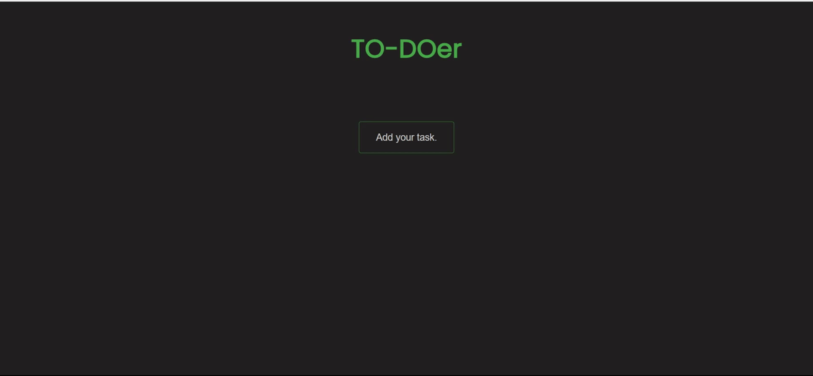
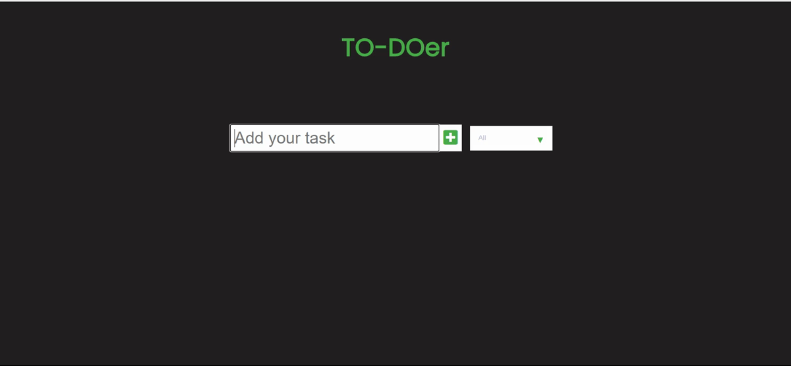
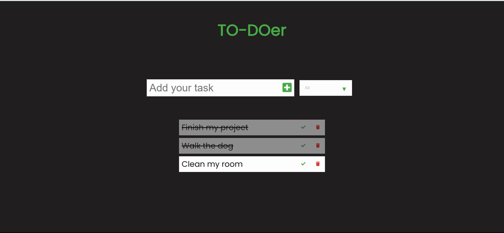

# TODO-List
This is a Single Page Application for a TODO List. You can add tasks to the list and check / delete them. All items are stored into a local storage.

You can type the task which you want to add to the list and it pressing the cross button.

You can check/uncheck and delete the task whenever you want to.

You can filter the task by: all / checked / unchecked

Special thanks to DevEd for helping young devs like me learn more!
